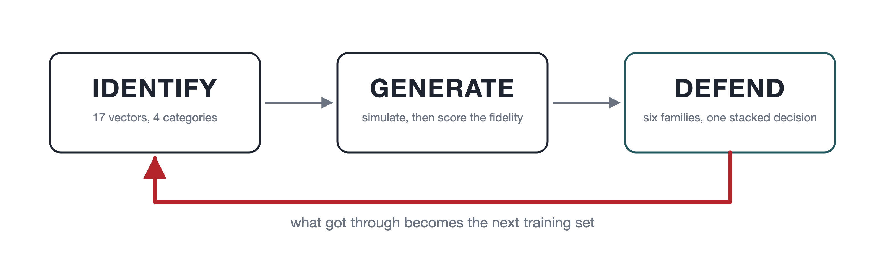
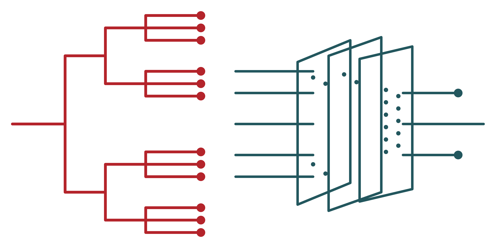
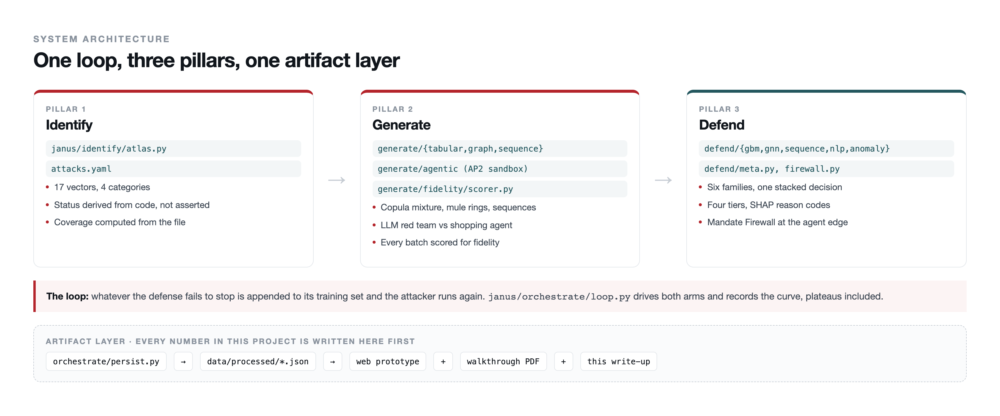

<div align="center">
  

  # JANUS

  **A closed-loop adversarial AI system for GenAI-powered payment fraud.
  The attacks it generates are the training set for the defense that catches them.**

  *Built by [Kavya Bhand](https://github.com/kavyabhand) & [Aadi Joshi](https://github.com/aadi-joshi)
  for the Mastercard Innovation Challenge 2026, GFF Mumbai*

  [](https://janus-beige.vercel.app)
  [](docs/JANUS_Solution_Walkthrough.pdf)
  [](https://www.python.org)
  [](https://react.dev)
  [](https://fastapi.tiangolo.com)
  [](tests/)
  [](#reproducing-every-number)
  [](LICENSE)
</div>

---

## The loop



Most submissions treat Identify / Generate / Defend as three deliverables bolted
together, because that is far easier to make look good than a system where each
pillar's failures are visible to the next. JANUS is built around the loop
instead, and takes it literally in two places:

**The defense trains on its own failures.** Every payload that reaches a
completed checkout is folded into the Mandate Firewall's classifier before the
next round runs. Every adversarial example that evaded the tabular scorer is
appended to its training set, still labelled fraud, and the model is refit.
Neither arm assumes this works; both measure whether the attacker's win rate
actually falls, and report a plateau as a plateau.

**Fidelity is a measurement, not an adjective.** A generator that produces
obviously synthetic data trains a defense against nothing, so every synthetic
batch is scored by training a classifier to separate it from real data. That
number is reported even when it is unflattering.

### Every number here is generated, not transcribed

One module, `janus/orchestrate/persist.py`, writes every result to
`data/processed/*.json`. The web prototype reads those files. The walkthrough
PDF is *built* from those files by `scripts/build_report.py`. A figure cannot
appear in this repository unless the pipeline produced it, and a section whose
artifact is missing says so rather than carrying forward an older run.

---

## Results

### Identify

| | |
|---|---|
| Attack taxonomy | **17 vectors, 4 categories** |
| Status breakdown | 8 simulated end to end, 2 modeled, 7 taxonomy-only |
| Coverage | every category has at least one vector simulated end to end |

Each entry is labelled `simulated` / `modeled` / `taxonomy_only` from what the
code actually does, and the coverage figure is computed from that file, so it
cannot overstate what exists. Nine of seventeen are not fully simulated and
the prototype says which.

### Generate

Each batch is scored by a classifier trained to separate it from real data.
**0.500 means it cannot tell them apart; 1.000 is a total failure.** This is the
opposite direction to every other score here.

| Batch | Distinguisher AUC | Correlation delta |
|---|---|---|
| Synthetic fraud transactions (ULB) | **0.556** | 0.166 |
| Synthetic legitimate transactions (ULB) | **0.607** | 0.033 |
| Mule-ring transfer amounts | 0.818 | degree-distribution KS **0.063**, clustering delta 0.000 |
| Voice-scam payment amounts | 0.735 | n/a |

Three findings behind those numbers matter more than the numbers:

- **The comparison was wrong before it was measured.** The original scorecard
  compared a batch generated at a 5% fraud ratio against a real sample carrying
  ULB's natural 0.172%, so much of what the classifier separated was the class
  mix, a parameter of the request rather than a property of the generator.
  Scoring per class dropped the correlation delta from 0.391 to 0.085 without
  touching the generator.
- **One Gaussian copula has one correlation matrix, and real payment
  populations do not.** Averaging several modes produces a joint distribution
  that matches the population's overall correlation while describing none of its
  actual modes. Marginals and pairwise correlations both still look right, which
  is why only the distinguisher catches it. Fitting a mixture took the fraud
  batch from 0.826 to 0.556, and the mixture size is chosen by measurement on an
  independent split.
- **A perfect score is a bug report.** The first synthetic-identity generator
  scored 1.000 on every metric with one feature carrying 62% of the model. See
  below.

#### Synthetic-identity rings, by how much infrastructure they rotate

| Ring type | What it pays for | Caught |
|---|---|---|
| Cheap | One device, one subnet, throwaway domains, bot-speed fill | **100%** |
| Moderate | Partial rotation, mixed mailbox age, some human pacing | **90%** |
| Advanced | Fresh device and residential IP per application, aged mainstream mailboxes, replayed human timing | **62%** |

Aggregate PR-AUC 0.953. The number that matters more is the cost to legitimate
people: **0.62%** of genuine thin-file applicants are flagged against 0.03% of
established customers. Both are reported, because a detector that scores well on
the aggregate while failing the first group is declining people for being new.

### Defend



| Family | PR-AUC | Measured on |
|---|---|---|
| Gradient-boosted trees | **0.877** | ULB, 284,807 real transactions |
| GNN + trees (hybrid) | **0.592** | IEEE-CIS, 590,540 rows / 606,270 nodes / 3,460,248 edges |
| Onboarding application scorer | 0.953 | 48,900 synthetic applications |
| Account-level graph features | 1.000 | 60 rings injected into real mobile-money data |
| Sequence transformer | 1.000 | 690 simulated entity histories |
| Behavioural fingerprint (voice-clone APP fraud) | 0.493 | the hardest problem here |

Every score is PR-AUC. Fraud is under 1% of traffic in every dataset here, so a
model that flags nothing scores 99% accuracy and a respectable ROC-AUC;
precision-recall area is the only one of the three that degrades honestly under
that imbalance. The two 1.000s are on synthetic test sets and are marked as such
rather than allowed to pass as headlines, and 0.493 is reported as measured
rather than tuned upward.

**Does the graph earn its place?** Ablated rather than assumed. The GraphSAGE
encoder alone reaches 0.412, worse than the tabular model. Concatenating its
embeddings into the gradient-boosted model reaches 0.592: the relational signal
and the tabular splitting are complementary, because the graph sees fraud
propagating between transactions sharing a card, device or email when each row
looks unremarkable.

**The stack**, on three disjoint splits (members on train, the stack on a
held-out meta split, everything reported on a test split neither saw): PR-AUC
**0.589** against 0.586 for the best single member. Score-level stacking buys
almost nothing over feature-level fusion here, which is reported rather than
hidden.

**Where decisions go**, at capacity-planned cuts: the top **0.2%** of volume
declines at **98.7%** precision, the next 1% goes to review at 88.6%.

**Can it run inline?** Single-row scoring p50 **3.1ms**, p95 3.7ms, p99 4.3ms,
against a 300ms authorization budget. SHAP reason codes attach to the fast
path's declines.

**A feature removed on purpose.** ULB's `Time` is seconds since the first row of
one two-day capture, which no live scorer has. It was also inside the fidelity
distinguisher and the evasion attacker's step size. Cost of removing it,
measured: PR-AUC 0.8796 to 0.8768.

### The closed loop

| Arm | Result |
|---|---|
| Agentic: **gpt-5.5** writing each payload from the full history of what was caught, against a gpt-5-mini shopping agent | **50% to 0%** bypass, held for three defended rounds. 48 attempts, 305 model calls, no provider refusals |
| Tabular: black-box greedy evasion, 5 rounds of iterative hardening | **86.1% to 41.0%** evasion, while held-out clean PR-AUC *rises* 0.884 to 0.887, and the displacement needed to evade grows **1.35σ to 2.39σ** |

Two of the four agentic techniques failed even undefended, so their defended
zero is a property of the shopping agent rather than the firewall. The prototype
says so on the same screen as the number.

Displacement is reported in per-feature standard deviations rather than raw L2,
which is in whatever units the features happen to carry and was dominated by the
highest-variance column.

---

## Architecture



| Pillar | What it does |
|---|---|
| **Identify** | A 17-attack taxonomy across four categories, each entry labelled from what actually runs. Rendered as a force-directed Attack Atlas; an Identify Agent proposes new candidate nodes for human review. `janus/identify/` |
| **Generate** | Five engines: an AP2 agentic-commerce sandbox with an adaptive red team, a mixture-of-copulas tabular synthesizer, a discrete-event behavioural simulator, a mule-ring graph generator, and a synthetic-identity onboarding generator, plus a black-box evasion engine that doubles as the attacker in the loop. `janus/generate/` |
| **Defend** | Six families, three of which score the same IEEE-CIS rows and stack into one calibrated four-tier decision. SHAP reason codes on the fast path. A deterministic Mandate Firewall sits in front of the agentic sandbox as real middleware, not a post-hoc grader. `janus/defend/` |
| **Orchestrate** | The closed self-play loop and every artifact the prototype and the PDF read from. `janus/orchestrate/` |

```
janus/
  common/       AP2 schemas, crypto, the maximal-flow mandate checker, shared
                eval metrics, the pluggable LLM backend, repo-anchored paths
  identify/     attacks.yaml + the Attack Atlas graph + the Identify Agent
  generate/
    agentic/    AP2 sandbox + red-team mutation loop + divergence scoring
    tabular/    mixture-of-Gaussian-copulas conditional synthesizer
    sequence/   behavioural simulator + voice-clone APP-fraud generator
    graph/      mule-ring topology generator + detector + OOD check
    identity/   synthetic-identity onboarding generator + scorer
    adversarial/ black-box greedy evasion + iterative hardening
    fidelity/   distributional distances + the full Fidelity Scorecard
  defend/       gbm / gnn / sequence / nlp / anomaly, meta-learner,
                Mandate Firewall, SHAP explanations
  orchestrate/  the closed loop, the stacked-ensemble run, persistence
  data/         credential-free dataset download + loaders
backend/        FastAPI over the artifacts, and the live agentic sandbox
frontend/       React + TypeScript + Tailwind, five screens
scripts/        snapshot baker, PDF generator, closed-loop merge
tests/          80 tests, fully offline
```

---

## Running it

```bash
git clone https://github.com/kavyabhand/maxout.git && cd maxout
python3.12 -m venv .venv && source .venv/bin/activate
pip install -r requirements.txt && pip install -e .

pytest tests/ -q          # 80 tests, offline, no credentials, no data, no GPU

uvicorn backend.app.main:app --reload --port 8000
cd frontend && npm install && npm run dev
```

With the backend running, every screen is live and attacks execute on demand.
With no backend, the same build serves the snapshot in
`frontend/src/data/snapshot.ts`: the identical measured artifacts plus a
transcript of each sandbox run, recorded by executing that same sandbox at build
time. The prototype labels which of the two produced what is on screen, which is
how the deployed build works with nothing running anywhere.

### Reproducing every number

```bash
python -m janus.data.download          # ~1.3GB from public mirrors, no account
python -m janus.orchestrate.persist    # rewrites data/processed/*.json
python scripts/build_snapshot.py       # bakes results into the frontend
python scripts/build_report.py         # regenerates the walkthrough PDF
```

The three benchmark datasets (ULB, IEEE-CIS, PaySim) are pulled anonymously over
HTTPS from public HuggingFace mirrors, each verified by exact row count and
label count so a truncated download fails loudly rather than silently skewing
every downstream number. There are no credentials anywhere in this repository
and none are required to reproduce any figure above.

Set `OPENAI_API_KEY` only to run the agentic arm against a live frontier model
instead of the deterministic scripted backend. Everything else runs without it.

---

## What this does not do

- Nine of seventeen atlas entries are not simulated end to end.
- The two 1.000 scores are on synthetic test sets, not real-world detection rates.
- Mule-ring and voice-scam detection are scored against fraud this project
  injected into real background data: grounded topology, our labels.
- The onboarding population is synthetic on both sides, because no public
  dataset labels synthetic-identity applications.
- No fidelity batch is fully indistinguishable from real data.
- The agentic sandbox reproduces the protocol shape of AP2, not a certified
  implementation.
- Every population here is labelled by construction. Deployment means retraining
  on confirmed-fraud outcomes with the reporting lag that implies, and the
  onboarding scorer would need disparate-impact testing this dataset cannot
  support.

---

<div align="center">
  <sub>MIT licensed. Built for the Mastercard Innovation Challenge 2026.</sub>
</div>
